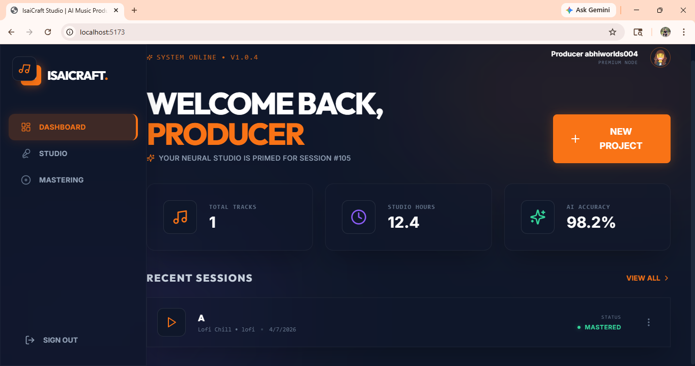
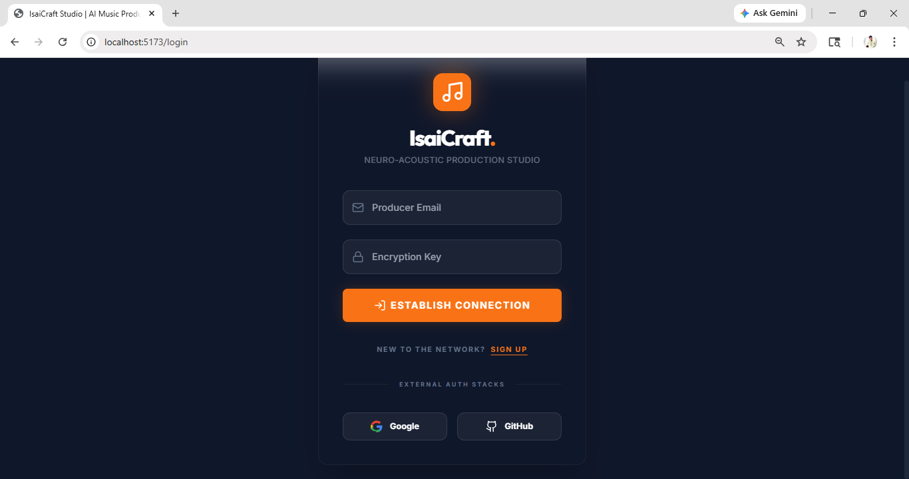
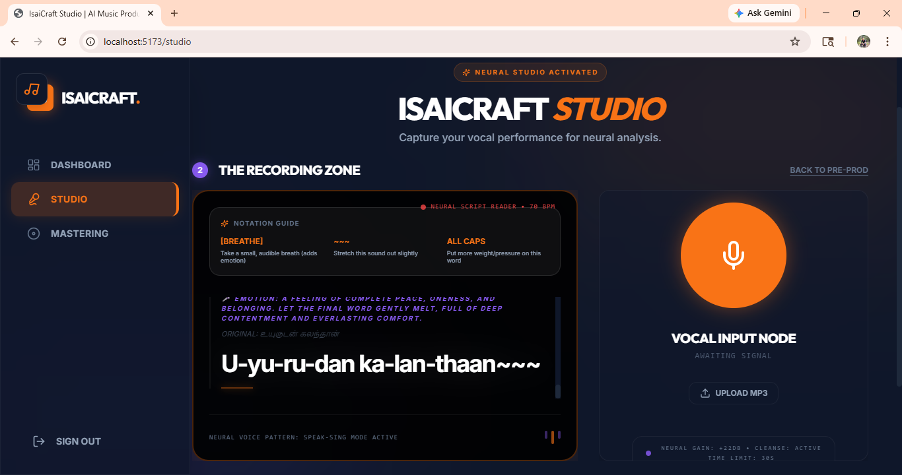
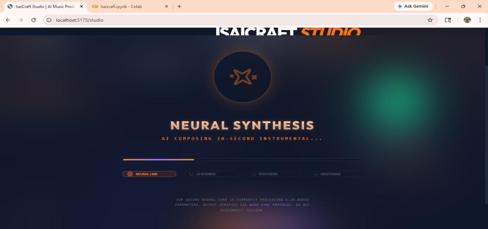
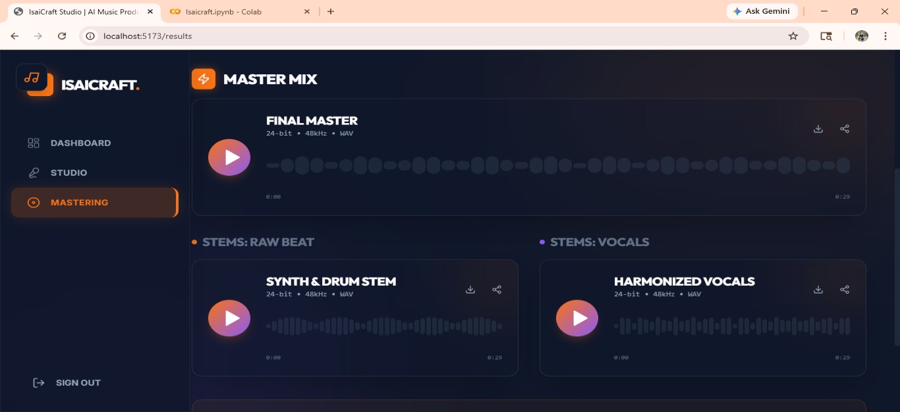
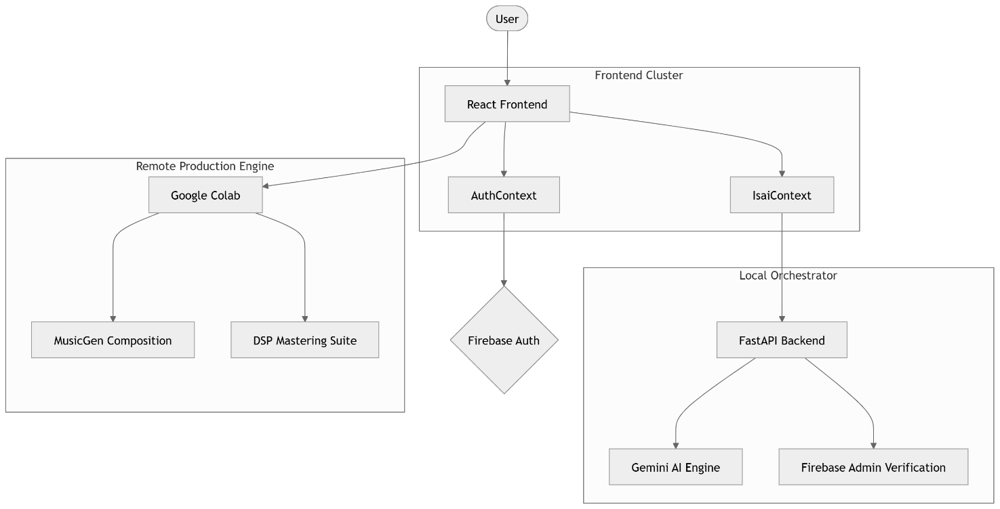

# 🎵 IsaiCraft

## Distributed AI-Assisted Music Production Studio

[](https://opensource.org/licenses/MIT)
[](https://www.python.org/)
[](https://fastapi.tiangolo.com/)
[](https://reactjs.org/)
[](https://vitejs.dev/)
[](https://firebase.google.com/)
[](https://colab.research.google.com/)

**IsaiCraft** is an AI audio-processing project designed as a three-tier ecosystem to assist amateur singers, independent lyricists, and content creators in producing music with their own vocal performances.

Rather than generating passive, flattened songs from text prompts alone, IsaiCraft combines **raw human vocals** with **AI-generated instrumental music**, provides **multilingual vocal coaching**, applies **humanized soft-pitch correction**, and programmatically executes **DSP mixing and mastering**.

---

## 🎯 Problem

Amateur singers and independent creators often encounter technical barriers when creating music:
1. **Intonation & Pitch Inaccuracy**: Non-professional singers frequently sing off-key. Traditional auto-tune algorithms apply 100% rigid quantization to nearest MIDI semitones, creating unnatural, robotic artifacts that strip away personal timbre and vibrato.
2. **Music Arrangement**: Composing and sequencing custom backing tracks requires instrument expertise, music theory, and DAW workflow mastery.
3. **Audio Engineering Complexity**: Equalization, dynamic compression, de-essing, room reverb, and mixbus mastering are technical skills inaccessible to casual creators.
4. **Hardware Constraints**: Running deep generative audio transformers locally exceeds the memory and compute capacity of standard consumer laptops.

---

## 💡 Solution

IsaiCraft addresses these challenges through a distributed, three-tier architecture:
- **Tier 1 — React Frontend**: In-browser recording booth with real-time waveform visualization, BPM-synced teleprompter, and multi-track stems player.
- **Tier 2 — FastAPI Backend / Orchestrator**: Manages Firebase JWT session authentication and uses Google Gemini 2.5 Flash for lyric analysis and phonetic singing guidance.
- **Tier 3 — Remote Google Colab GPU Engine**: Runs Meta MusicGen for instrumental synthesis, noisereduce for acoustic cleansing, PyWorld for 55% fractional pitch correction, and Spotify Pedalboard for studio FX chains and soft-saturation mastering.

---

## 🏗️ Architecture

```text
React Frontend (Vite / SPA)
        │
        │ 1. HTTP (Bearer JWT + Lyrics / Metadata)
        ▼
FastAPI Backend / Orchestrator (:8000)
        │
        ├── Firebase Admin SDK (JWT cryptographic token verification)
        └── Google Gemini 2.5 Flash (Phonetic vocal guide generation)
        │
        │ 2. HTTP / FormData (Vocals.wav + SuperPrompt) via PyNgrok
        ▼
Google Colab GPU Engine (NVIDIA T4 CUDA)
        │
        +--------------------------------+--------------------------------+
        │                                                                 │
        ▼                                                                 ▼
   Meta MusicGen                                                      Vocal DSP
(facebook/musicgen-small)                                                 │
        │                                                 +---------------+---------------+
        │ Instrumental EQ                                 │                               │
        │ (HPF 40Hz, Peak 2500Hz -6dB)                 noisereduce                     PyWorld
        │                                         (Acoustic Cleansing)          (DIO + StoneMask F0
        │                                                 │                      55% Soft Retune)
        │                                                 +---------------+---------------+
        │                                                                 │
        │                                                                 ▼
        │                                                        Spotify Pedalboard
        │                                                    (EQ, Comp, Reverb, +6dB Gain)
        │                                                                 │
        +--------------------------------+--------------------------------+
                                         │
                                         ▼
                                   Mixing Layer
                          • Beat Peak Normalization: 0.35
                          • Vocal Peak Normalization: 0.90
                          • Summation: mixed_raw = music_norm + vocal_norm
                                         │
                                         ▼
                             Master Audio Processing
                          • Mastering Compressor (-12dB, 2.5:1)
                          • Post Gain (+1.5dB)
                          • Soft Saturation: np.tanh(...)
                                         │
                                         ▼
                             Base64 Audio Response
                        { status, music, vocal, master }
                                         │
                                         ▼
                             React UI & Stems Player
```

---

## 🧠 AI & Audio Technologies

| Layer / Component | Technology | Responsibility |
|---|---|---|
| **Tier 1: Audio Capture** | Web Audio API / MediaRecorder | Lossless browser audio acquisition and WAV blob generation |
| **Tier 2: Vocal Coaching** | Google Gemini 2.5 Flash | Parses lyrics (Tamil/Tanglish/English) into phonetic breakdowns (`-`), breath pauses (`[Breathe]`), pitch holds (`~~~`), and emotional cues |
| **Tier 2: Security Gateway** | Firebase Admin SDK | Server-side cryptographic JWT verification |
| **Tier 3: Instrumental Synthesis** | Meta MusicGen Small | Autoregressive transformer generating 32kHz instrumental backing tracks conditioned on mood and genre prompts (`max_new_tokens=1500`) |
| **Tier 3: Acoustic Cleansing** | `noisereduce` | Non-stationary spectral gating (`prop_decrease=0.85`) to remove mic static and room reflections |
| **Tier 3: Pitch Extraction & Retuning** | PyWorld Vocoder | DIO and StoneMask $F_0$ extraction, median filter smoothing, and 55% fractional pitch correction toward 12-TET chromatic semitones |
| **Tier 3: Vocal & Mix FX** | Spotify Pedalboard | Parametric EQ (HPF, Peak, High Shelf), dynamic compression, studio reverb, and post-gain leveling |
| **Tier 3: Mixbus Mastering** | NumPy & Pedalboard | Peak normalization (Beat: 0.35, Vocal: 0.90), mastering compression, +1.5dB gain, and `np.tanh` analog soft saturation |
| **Tier 3: Network Tunnel** | pyngrok | Secure HTTPS tunneling from Google Colab microservice to local development client |

---

## 🎚️ Humanized Soft-Pitch Correction

Standard auto-tuning applies rigid mathematical quantization to the nearest 12-TET semitone:

$$\text{midi\_note} = 69 + 12 \log_2\left(\frac{f}{440}\right)$$

$$\text{snapped\_midi} = \text{round}(\text{midi\_note})$$

$$f_{\text{target}} = 440 \times 2^{\frac{\text{snapped\_midi} - 69}{12}}$$

When vocalists exhibit natural intonation variations, hard quantization creates robotic "stair-stepping" artifacts.

IsaiCraft introduces **Fractional Harmonic Retuning**:

$$f_{\text{tuned}} = f + \left(f_{\text{target}} - f\right) \times \text{retune\_strength}$$

Where $\text{retune\_strength} = 0.55$.

This formula gently draws off-key frequencies 55% toward harmonic resonance, eliminating off-pitch errors while preserving the natural vibrato, timbre, and organic human expression.

---

## 🔐 Authentication & Security

- **Client Token Issuance**: Firebase Authentication issues signed JWTs upon user login.
- **Backend Validation**: FastAPI uses `firebase-admin` to decode and verify bearer tokens on protected endpoints (`/api/vocal-guide`).
- **Secrets Isolation**: Real API keys, Firebase service account keys, and ngrok tokens are managed strictly via environment variables and Colab Secrets. None are tracked in Git.
- **CORS Protection**: FastAPI enforces origin whitelisting (`http://localhost:5173`) and processes `ngrok-skip-browser-warning` headers.

---

## 📁 Project Structure

```
IsaiCraft-AI-Music-Studio/
├── frontend/                      # Tier 1: React + Vite SPA
│   ├── src/
│   │   ├── components/            # Layout, VocalBooth, CustomAudioPlayer, MultiStepLoading
│   │   ├── context/               # AuthContext, IsaiContext
│   │   ├── hooks/                 # useAudioRecorder, useProduceMusic
│   │   ├── lib/                   # api.js, audioUtils.js, firebase.js
│   │   ├── pages/                 # LoginPage, DashboardPage, StudioPage, ResultsPage
│   │   └── router/                # AppRouter (Protected routes)
│   ├── package.json
│   ├── vite.config.js
│   ├── .env.example
│   └── README.md
│
├── backend/                       # Tier 2: FastAPI Orchestrator & Gemini Gateway
│   ├── main.py                    # Orchestrator entry point & Firebase token auth
│   ├── requirements.txt           # Backend Python dependencies
│   ├── firebase-adminsdk.example.json # Safe service account template
│   ├── .env.example
│   └── README.md
│
├── colab/                         # Tier 3: Remote Google Colab GPU Engine
│   ├── IsaiCraft_GPU_Engine.ipynb # Original MusicGen + PyWorld DSP pipeline notebook
│   └── README.md
│
├── docs/                          # Project Documentation & Architecture
│   ├── ARCHITECTURE.md            # Architectural specification & data-flow walkthrough
│   ├── AUDIO_PIPELINE.md          # Technical DSP & pitch correction mathematical breakdown
│   ├── SETUP.md                   # Full step-by-step distributed setup guide
│   ├── architecture.png           # Architecture diagram
│   ├── audio-pipeline.png         # Audio pipeline diagram
│   ├── sequence-diagram.png       # Sequence diagram
│   ├── auth-workflow.png          # Auth workflow diagram
│   └── project-report.pdf         # Official Major Project Academic Report
│
├── screenshots/                   # Application UI Walkthrough
│   ├── 01_login.png               # Login Gateway
│   ├── 02_dashboard.png           # Studio Overview & Analytics
│   ├── 03_vocal_studio.png        # Guided Teleprompter & Recording Booth
│   ├── 04_neural_processing.png   # Multi-Step Neural Synthesis Loading
│   └── 05_mastering_results.png   # Final Mastered Stems Player
│
├── .gitignore                     # Git exclusion rules
├── .env.example                   # Master environment variables template
├── LICENSE                        # MIT License
└── README.md                      # Project Portfolio Overview
```

---

## 🚀 Setup & Execution

### 1. Google Colab GPU Engine (Tier 3)
1. Open [Google Colab](https://colab.research.google.com/) and upload [`colab/IsaiCraft_GPU_Engine.ipynb`](./colab/IsaiCraft_GPU_Engine.ipynb).
2. Set runtime accelerator to **T4 GPU** (**Runtime -> Change runtime type**).
3. Add your `NGROK_AUTHTOKEN` in Colab Secrets (or enter it when prompted).
4. Run all cells (`Ctrl + F9`).
5. Copy the generated public ngrok URL (e.g. `https://xxxx-xx-xx.ngrok-free.dev`).

### 2. Local FastAPI Backend (Tier 2)
```bash
cd backend
python -m venv venv
# Windows:
.\venv\Scripts\Activate.ps1
# Linux/macOS:
source venv/bin/activate

pip install -r requirements.txt
cp .env.example .env
# Edit .env with your GEMINI_API_KEY
python main.py
```

### 3. React Web Frontend (Tier 1)
```bash
cd frontend
npm install
cp .env.example .env
# Set VITE_GPU_ENGINE_URL to your Colab ngrok URL
npm run dev
```
Open `http://localhost:5173` in your browser.

---

## 📸 Screenshots

| 1. User Login Gateway | 2. Dashboard Overview |
|:---:|:---:|
|  |  |

| 3. Vocal Studio & Guided Teleprompter | 4. Neural Processing Pipeline |
|:---:|:---:|
|  |  |

| 5. Final Mastered Stems & Visualizer | Architecture Diagram |
|:---:|:---:|
|  |  |

---

## 🎥 Demo Video

[](YOUR_DEMO_LINK)

---

## 📄 Academic Project Documentation

The complete academic project documentation is included:
- **Major Project Report**: [`docs/project-report.pdf`](./docs/project-report.pdf)
- **Architecture Specification**: [`docs/ARCHITECTURE.md`](./docs/ARCHITECTURE.md)
- **Audio DSP Pipeline Specification**: [`docs/AUDIO_PIPELINE.md`](./docs/AUDIO_PIPELINE.md)
- **Deployment & Setup Guide**: [`docs/SETUP.md`](./docs/SETUP.md)

---

## ⚠️ Prototype Limitations

- **Transient GPU Sessions**: Free-tier Google Colab instances timeout when idle, requiring restarting the notebook and updating the ngrok endpoint URL.
- **Cold Start Latency**: Downloading and loading `facebook/musicgen-small` into GPU VRAM takes ~90–120 seconds on initial startup.
- **Asynchronous Round-Trip Time**: Full generative inference and multi-step DSP mastering takes 60–90 seconds per track on a T4 GPU.
- **Prototype Scope**: The application is an interview and portfolio prototype designed for development demonstration rather than large-scale concurrent multi-tenant production.

---

## 🚀 Future Improvements

- **Dedicated Cloud GPU Hosting**: Deploy the Tier 3 inference engine to dedicated containerized GPU services (such as Modal, RunPod, or AWS EC2 G4dn).
- **Multiplayer Collaborative DAW**: Implement WebSockets for real-time collaborative lyric writing and multi-user studio sessions.
- **Regional Instrument Fine-Tuning**: Fine-tune MusicGen on traditional South Asian and Tamil acoustic instrumentation (Parai, Thavil, Nadaswaram, Veena).
- **Client-Side WebAssembly Vocoder**: Port PyWorld to WebAssembly (Wasm) for zero-latency client-side pitch visualizer feedback.

---

## 👨💻 Author

**Abhimanyu T**  
Master of Computer Applications (MCA) Graduate  
Project: Major Project MCA (2026)
