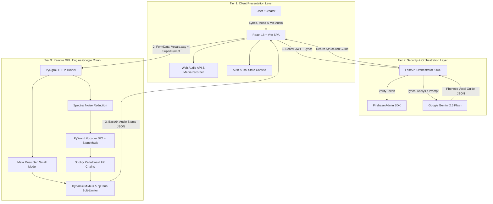

# 🏗️ IsaiCraft System Architecture

IsaiCraft is designed as a distributed, triple-tier architecture that decouples client interaction from high-throughput GPU generative inference and programmatic DSP mastering.

---

## 🧩 Architectural Modules Breakdown

### MOD-01: Identity & Access Management
- **Role**: Validates user credentials and maintains cryptographic session boundaries.
- **Components**: Firebase Authentication (Client Web SDK) & Firebase Admin SDK (Server).
- **Workflow**: Frontend acquires an OIDC-compliant ID token and transmits it in the `Authorization: Bearer <token>` header. The FastAPI middleware decodes and verifies the token on every protected transaction.

### MOD-02: Project Orchestrator & LLM Vocal Director
- **Role**: Orchestrates project metadata and leverages Google Gemini 2.5 Flash for natural language vocal direction.
- **Workflow**: Translates unstructured lyrics (in Tamil, Tanglish, or English) into an empathetic phonetic breakdown with explicit performance cues (e.g. breath marks `[Breathe]`, syllable pacing `-`, and dynamic emphasis `ALL CAPS`).

### MOD-03: Remote GPU Engine & Neural Synthesis
- **Role**: Generates high-fidelity instrumental backing tracks conditioned on mood and genre prompts.
- **Model**: Meta's `facebook/musicgen-small` transformer.
- **Hardware**: Cloud-hosted NVIDIA CUDA GPU (Google Colab T4).

### MOD-04: DSP Mastery Node & Soft-Pitch Correction
- **Role**: Programmatic audio engineering pipeline.
- **Processing Chain**:
  1. **Acoustic Cleansing**: Non-stationary spectral filtering with `noisereduce`.
  2. **Humanized Pitch Correction**: PyWorld vocoder (`dio`, `stonemask`, `cheaptrick`, `d4c`) with a fractional `retune_strength=0.55` to preserve human vibrato while eliminating off-key dissonance.
  3. **Vocal FX Chain**: Spotify Pedalboard (Highpass 100Hz, Peak 300Hz boxiness removal, High Shelf 7.5kHz vocal sheen, 4:1 compression, subtle room reverb).
  4. **Dynamic Mixbus**: Beat peak capped at 0.35, vocal stem boosted to 0.90, summed and soft-limited through `np.tanh` saturation.

### MOD-05: UX State Engine
- **Role**: Manages asynchronous client state, real-time audio visualization, recording streams, and stem playback.
- **Tech Stack**: React 18, React Context API, Framer Motion, Tailwind CSS.

### MOD-06: Network Bridge & Tunneling Layer
- **Role**: Bypasses NAT firewalls and provides a secure, public HTTPS ingress into transient Google Colab GPU instances using `pyngrok`.
- **CORS Handling**: Whitelisted origins and `ngrok-skip-browser-warning` headers ensure smooth machine-to-machine payload transfer.
